# Neural PDE Solvers  
**Author:** Abhie Koirala  
**Started:** February 18, 2026  
**Hardware:** MacBook, iPhone

---

## What This Project Is

A self-directed research project benchmarking physics-informed neural networks (PINNs) against classical numerical methods — in the specific domains where classical methods are known to break down.

Everything is built from scratch. Every claim is validated against a ground truth. Failures are documented as honestly as results.

**Core research question:** Can physics-informed neural networks match or exceed the accuracy of classical solvers in domains where classical solvers struggle — and can that be proven rigorously?

---

## Why Classical Methods Fail (The Problem Being Solved)

Traditional numerical methods for PDEs — Finite Difference (FDM), Finite Element (FEM), Finite Volume (FVM) — have three well-documented failure modes:

1. **Complex geometry** — mesh generation breaks down on non-convex, irregular 3D domains (e.g. 3D-printed lattice structures). Mesh quality degrades at reentrant corners and sharp features. A human has to manually repair the mesh. This is a bottleneck.
2. **High dimensionality** — FDM grid size grows exponentially with the number of dimensions (curse of dimensionality). A 5-asset option pricing problem requires a 5D grid. A 100-asset problem is completely intractable with classical methods.
3. **Parameter sweeps** — solving the same PDE for thousands of different parameter sets requires re-running the full solver each time. Slow and expensive.

Neural networks sidestep all three: they are mesh-free, they scale more gracefully with dimension, and once trained they can generalize across parameter space without retraining.

---

## The Scientific Method Constraint

> *A solver without a benchmark is just a generator of structured noise.*

Every single stage follows this structure — no exceptions:

1. Build the **ground truth** first (analytical solution, Monte Carlo, or FD solver)
2. Build the **neural method**
3. **Compare** against ground truth with explicit error metrics
4. **Document failures** — where the method breaks and exactly why


---

## Roadmap

### Stage 1 — Hard Boundary Constraints

**Problem:** 1D Heat Equation with Dirichlet boundary conditions

**What the heat equation is:** A PDE describing how temperature spreads through a rod over time. The simplest non-trivial PDE. Boundary conditions mean the temperature at each end of the rod is fixed (e.g. u(0,t) = 0, u(1,t) = 0).

**Why start here:** Smallest possible problem. When something breaks, the reason is unambiguous. No complexity to hide behind.

**The core technique — Ansatz Engineering:**
Standard PINNs enforce boundary conditions as a soft penalty in the loss function. The network is *penalized* for violating the boundary but not *prevented* from doing so. The result is approximate — the boundary condition is almost satisfied, not exactly satisfied.

Ansatz engineering fixes this by building the boundary condition directly into the network's output algebraically:

```
u_final(x, t) = x · (1 - x) · NN(x, t)
```

No matter what the neural network NN predicts, the output is guaranteed to be zero at x=0 and x=1. The constraint is structural, not learned.

**Ground Truth:** Fourier series exact solution
**Success Metric:** L∞ < 10⁻⁶ (machine precision error near boundaries)
**Failure to watch for:** A spike in pointwise error at the boundary = the Ansatz suppressed gradients instead of enforcing the constraint. This is the canonical Stage 1 failure mode.

---

### Stage 2 — High-Dimensional Pricing

**Problem:** 5-Asset Rainbow Option pricing

**What a rainbow option is:** An option whose payoff depends on multiple underlying assets simultaneously. A 5-asset rainbow pays based on e.g. the maximum or minimum of 5 stock prices at expiry. Pricing it requires solving a 5-dimensional PDE.

**Why FDM fails here:** A finite difference grid in 5 dimensions with 100 points per axis = 100⁵ = 10 billion grid points. Completely intractable. This is not a hardware problem — it is a fundamental structural failure of the method.

**Why PINNs scale better:** Instead of a grid, a PINN samples random collocation points in the domain. The number of points needed grows much more slowly with dimension. This is the core advantage being tested.

**The method — Deep BSDE:**
Instead of solving the PDE directly, Deep BSDE reformulates it as a stochastic control problem (backward stochastic differential equation). A neural network learns the gradient of the solution, and the solution itself emerges from simulating forward in time. Specifically designed for high-dimensional parabolic PDEs like the Black-Scholes equation.

**Validation path:** Start with 2-asset case where closed-form solution exists. Match to <2% error. Then scale to 5 assets. The jump from 2 to 5 is where the research finding lives.

**Ground Truth:** Monte Carlo (10M+ paths)
**Success Metric:** Mean relative error < 0.5% across ITM and OTM regions
**Failure to watch for:**
- Matches MC in center but deviates >5% at edges → collocation point sampling problem (hardest unsolved problem in this stage)
- Gamma is noisy or "wiggly" compared to MC → network needs more regularization
- Greeks look wrong even when price looks right → classic PINN failure, derivatives are less reliable than values

---

### Stage 3 — Neural Operator

**Problem:** Heston Volatility Surface Mapping

**What the Heston model is:** A stochastic volatility model where the volatility of a stock is itself random and mean-reverting. Described by a 2D PDE in stock price S and variance v. Used to price options when the market exhibits a volatility smile — which it always does in practice.

**The Heston PDE parameters:** κ (mean reversion speed), θ (long-term variance), σ (vol of vol), ρ (correlation between asset and variance), v₀ (initial variance). Each set of parameters gives a different volatility surface.

**Why a standard PINN isn't enough here:** A PINN trained on one set of Heston parameters gives you one solution. Change κ by 0.1 and you have to retrain from scratch. For practical calibration this is useless — calibration requires solving the PDE thousands of times for different parameter sets.

**The method — DeepONet (Deep Operator Network):**
Instead of learning a solution, DeepONet learns the *mapping between functions*. It takes a set of Heston parameters as input and outputs the entire volatility surface — for any parameters, without retraining. This is the difference between a solver and an operator.

Architecture: two sub-networks — a branch network that encodes the input parameter set, and a trunk network that encodes the query point (S, v, T). Their outputs are combined via a dot product to produce the solution value.

**Ground Truth:** Heston FD solver (ADI/Crank-Nicolson), built from scratch
**Success Metric:** Error < 1% across the entire generated volatility smile
**Validation protocol:**
- Run FD solver for 1,000 different parameter sets (κ, θ, σ, ρ, v₀)
- Feed same parameter sets into DeepONet
- Check: does error spike in high-volatility regimes? If yes, training distribution didn't cover that corner of parameter space

**Failure to watch for:** Defining the training distribution over Heston parameter space is itself a research problem. If parameters are sampled uniformly, the network will fail on extreme regimes.

---

## Known Hard Problems

These are not edge cases. These are the central difficulties.

| Challenge | Why It's Hard | Planned Approach |
|---|---|---|
| Generalization / extrapolation failure | NNs memorize curves instead of learning physics | Operator learning (DeepONet), domain randomization |
| Soft boundary conditions | PINNs only approximately satisfy boundary conditions by default | Ansatz engineering (Stage 1), Augmented Lagrangian method |
| Training instability | PDE loss landscapes have high-frequency gradients; physics loss and data loss fight each other | NTK adaptive weighting, curriculum learning |
| No accuracy guarantees | Unlike FEM, no rigorous error bounds exist | Hybrid ML+FDM polishing, a posteriori residual as error map |
| Collocation point sampling | Where training points are placed determines everything in high dimensions | Active research area — expected to be the hardest problem in Stage 2 |

### The A Posteriori Residual — A Self-Diagnosing Error Map

Since the PDE F(u) = 0 is known exactly, the network's prediction can be plugged back into the equation. The residual |F(û(x))| at each point tells you directly how wrong the network is there — no ground truth needed. High residual = unreliable region. Used as a trust map for the solution in Stage 3 where running the FD solver for every query is too expensive.

---

## What Needs To Be Built (Full TODO)

### Prerequisites — Learn First
- [x] Read: Raissi et al. 2019 (original PINN paper) — understand loss function construction
- [x] Read: Lu et al. 2021 (DeepONet paper) — understand branch/trunk architecture
- [x] Read: E, Han & Jentzen 2017 (Deep BSDE paper) — understand the BSDE reformulation

### Stage 1 — To Build
- [x] Fourier series ground truth solver (Python, ~20 lines)
- [x] 1D PINN with standard soft boundary conditions (PyTorch baseline)
- [x] 1D PINN with Ansatz engineering (hard boundary enforcement)
- [x] Pointwise error plot |u_pinn - u_exact| across full domain
- [x] Comparison: soft BC vs hard BC error at boundary
- [x] Laplace eigenfunctions on complex domains (Koch snowflake, star)
- [x] Adaptive multi-scale resampling for fractal boundary resolution

### Stage 2 — To Build
- [x] 2-asset Black-Scholes FDM solver (Python, validation baseline)
- [x] Monte Carlo simulator (NumPy, 10M paths, arbitrary number of assets)
- [x] Deep BSDE solver (PyTorch)
- [x] Greeks computation: Delta and Gamma from both BSDE and MC
- [x] Error analysis: ITM vs OTM breakdown, boundary vs interior comparison

### Stage 3 — To Build
- [x] Heston FD solver from scratch (Python, implicit in log-spot coordinates)
- [x] Semi-analytical Heston pricer (characteristic function, Gil-Pelaez inversion)
- [x] Parameter sampling distribution for Heston space (κ, θ, σ, ρ, v₀)
- [x] Training data generator: 874 valid surfaces via char fn
- [x] DeepONet architecture (PyTorch): branch network + trunk network
- [x] Training pipeline, 699/175 train/test split
- [x] Error analysis across test set
- [x] Regime analysis: error vs Feller condition and parameter extremes

### Infrastructure
- [x] Set up Python environment (PyTorch, DeepXDE, NumPy, SciPy, Matplotlib)
- [x] Set up experiment logging (loss curves, error metrics per run)

---

## Stack

| Component | Tool | Why |
|---|---|---|
| PINN framework | DeepXDE first, raw PyTorch when needed | DeepXDE handles boilerplate fast; PyTorch for full control later |
| Neural operator | PyTorch (manual DeepONet implementation) | Need to understand the architecture, not just run it |
| Ground truth MC | C++ with multithreading | Speed — 10M paths needs to be fast |
| FD baseline | Python + NumPy | Readable, debuggable |
| Compute | MacBook (local training), iPhone (reference/notes) | Personal hardware only |
| Plotting | Matplotlib | Simple, standard |

---

## References

- Raissi, M., Perdikaris, P., & Karniadakis, G.E. (2019). Physics-informed neural networks: A deep learning framework for solving forward and inverse problems involving nonlinear PDEs. *Journal of Computational Physics.*
- Lu, L., Jin, P., Pang, G., Zhang, Z., & Karniadakis, G.E. (2021). Learning nonlinear operators via DeepONet based on the universal approximation theorem of operators. *Nature Machine Intelligence.*
- E, W., Han, J., & Jentzen, A. (2017). Deep learning-based numerical methods for high-dimensional parabolic PDEs and their control problems. *Communications in Mathematics and Statistics.*
- E, W. (2021). The dawning of a new era in applied mathematics. *Notices of the AMS.*

---

## Stage 1 — Results

### Soft BC vs Hard BC (Ansatz) Comparison

| | L∞ Error | Boundary Error (x=0) |
|---|---|---|
| Soft BC | 9.15e-03 | 2.54e-03 |
| Hard BC (Ansatz) | 5.97e-04 | **0.00e+00** |

Hard BC achieves **15x lower** overall error and **exactly zero** boundary error by construction. The ansatz `u = x(1-x)·NN(x,t)` structurally guarantees the Dirichlet condition — the optimizer never has to learn it.

**Exact solution vs PINN predictions (error heatmaps):**

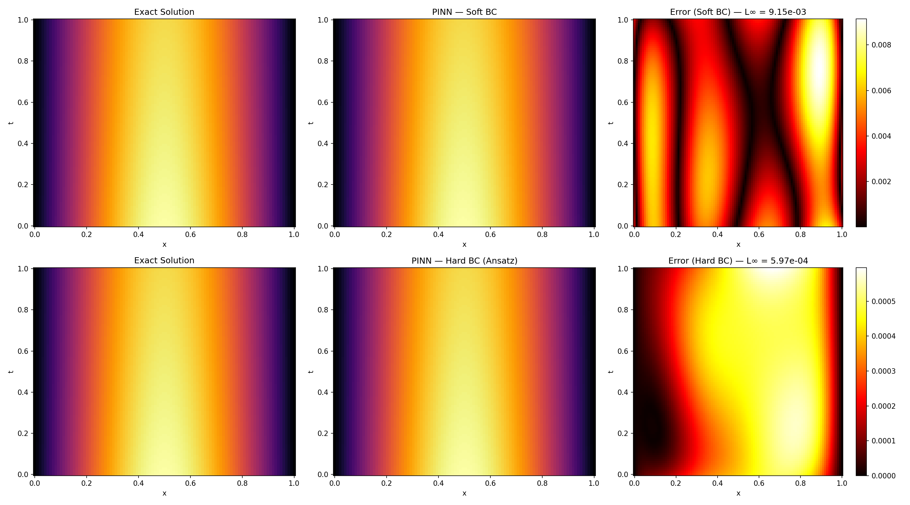

Top row: soft BC error is spread across the domain, worst at boundaries. Bottom row: hard BC error is concentrated in the interior only — boundaries are exact.

**Boundary error over time:**

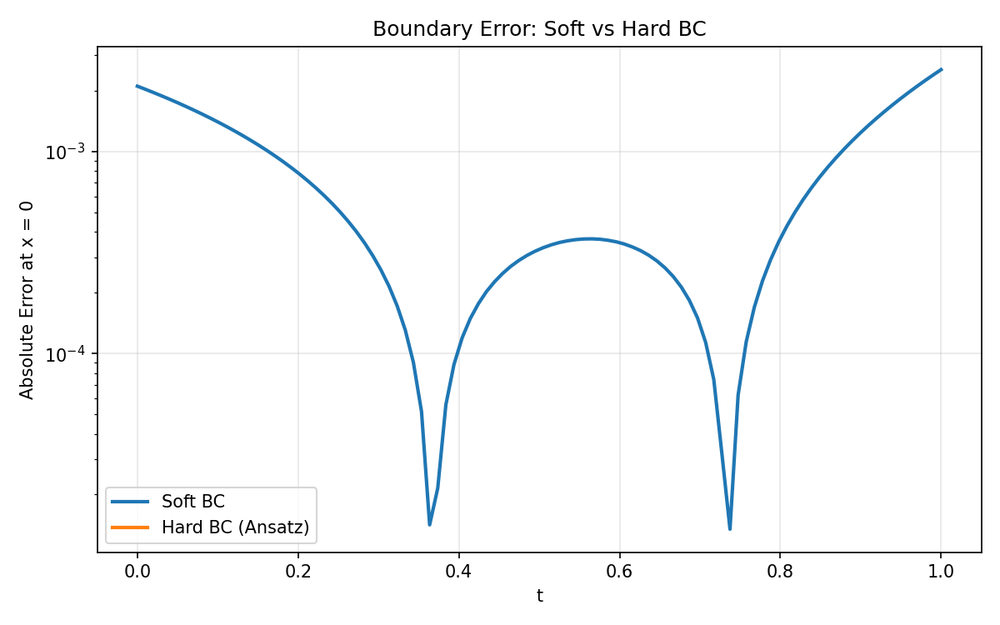

The hard BC line (orange) sits at zero. The soft BC line oscillates between 10⁻⁴ and 10⁻³.

**Training loss curves:**

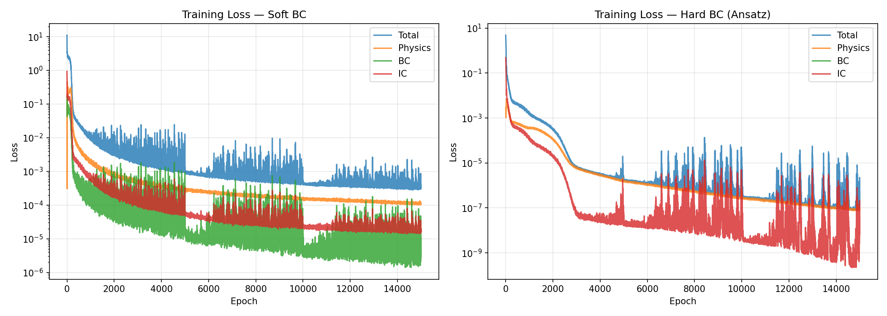

Hard BC loss reaches 10⁻⁶ by epoch 5000. Soft BC plateaus around 10⁻⁴. BC loss for hard BC is always exactly zero.

**Ground truth — exact Fourier series solution:**

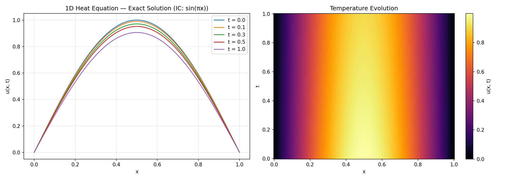

### Laplace Eigenfunctions on Complex Domains

Extension: solving ∇²u = -λu with u=0 on the boundary, where the eigenvalue λ is unknown and learned as a free parameter. PINNs are mesh-free, so fractal and irregular boundaries are no harder than circles — no mesh generation needed.

**Validation:** Unit circle first eigenvalue λ = 5.787 vs exact 5.783 (0.06% error).

Then applied to domains where FEM mesh generation is painful or impossible:

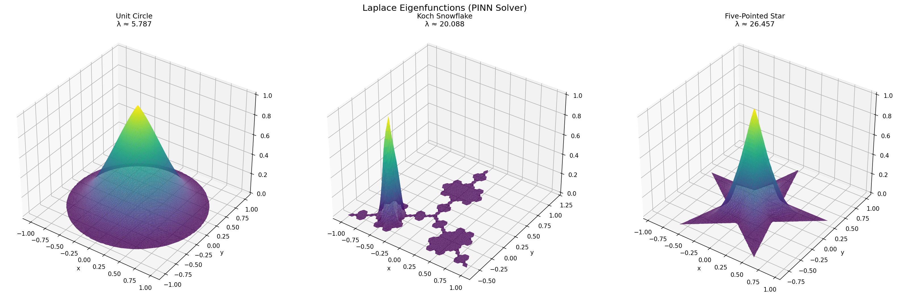

**Importance-weighted collocation** addresses the fractal boundary resolution problem. The naive approach — replacing collocation points with new ones in high-error regions — causes massive training instability (loss spikes of 10,000-38,000x) due to sudden distribution shift. Instead, all collocation points are fixed for the entire training, and per-point weights in the loss function are updated periodically based on the PDE residual. High-error points (near fractal inlets) count more; low-error points count less. No distribution shift, no spikes.

| Method | Training spikes | Final physics loss |
|--------|----------------|-------------------|
| Uniform (fixed, no adaptation) | 0 | 0.0024 |
| Point-swap adaptive (old) | 5 major (up to 38,515x) | 0.50 |
| Importance-weighted (fixed, adaptive weights) | 0 | 0.015 |

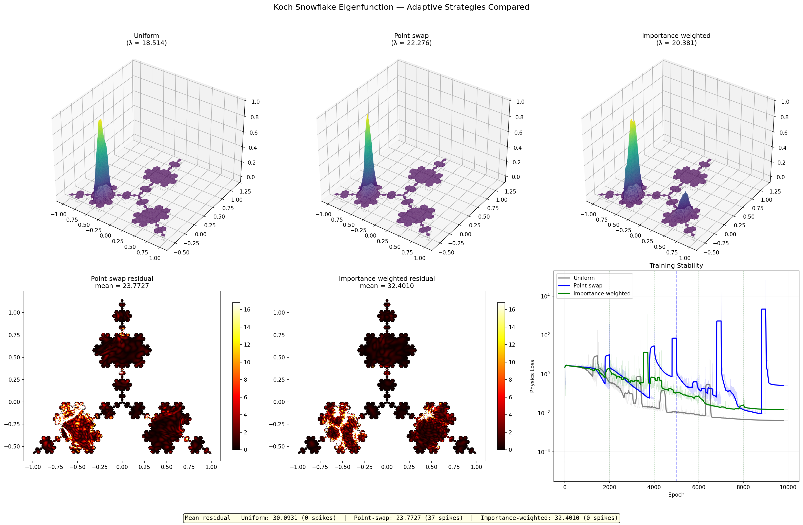

---

## Stage 2 — Results

### Ground Truth Validation: FDM vs Monte Carlo (2-asset)

| Method | Price V(100,100) | Time |
|---|---|---|
| FDM (60x60 grid, fully implicit) | 18.7773 | 3.4s |
| MC (10M paths) | 18.8245 ± 0.0072 | 0.6s |

Difference of 0.05 is within MC standard error — both methods agree. FDM serves as the 2D baseline; MC is the ground truth for 5+ assets where FDM is intractable.

### Deep BSDE vs Monte Carlo

| | 2-Asset | 5-Asset |
|---|---|---|
| MC (10M paths) | 18.8245 ± 0.0072 | 31.9441 ± 0.0080 |
| Deep BSDE | 18.8117 ± 0.0745 | 31.9402 ± 0.0805 |
| **Relative error** | **0.07%** | **0.01%** |

Both well under the 0.5% target. The Deep BSDE matches MC pricing to high accuracy.

**Training loss and price comparison:**

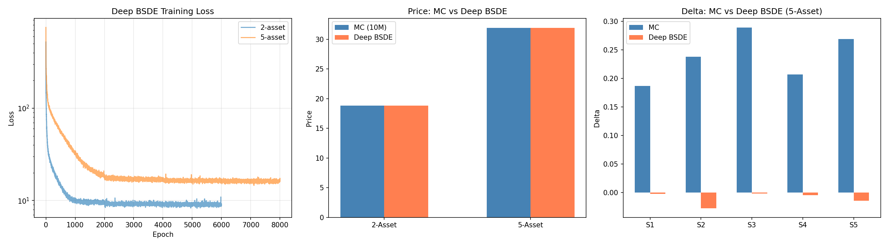

### Predicted Failure Mode: Greeks

The roadmap predicted "Greeks look wrong even when price looks right" — this happened exactly. MC deltas for the 5-asset case range from 0.19 to 0.29. Deep BSDE deltas are all near zero. The BSDE learns the price at a single initial condition (S0 = 100 for all assets) but the Z networks don't generalize to nearby spot prices. Bump-and-reprice gives near-zero sensitivity because the model was never trained at the bumped values.

| Asset | MC Delta | BSDE Delta |
|---|---|---|
| S1 (σ=0.20) | 0.1866 | -0.0023 |
| S2 (σ=0.25) | 0.2376 | -0.0276 |
| S3 (σ=0.30) | 0.2892 | -0.0016 |
| S4 (σ=0.22) | 0.2067 | -0.0047 |
| S5 (σ=0.28) | 0.2686 | -0.0146 |

This is a structural limitation of Deep BSDE — it solves the PDE at a point, not over the domain. Getting correct Greeks would require training across multiple S0 values or using a method that learns the full solution surface.

### Scaling to 100 Assets

C++ Monte Carlo ground truth (10M paths each):

| Assets | MC Price | MC Stderr | MC Time |
|---|---|---|---|
| 2 | 18.8423 | ±0.0072 | 107ms |
| 5 | 31.9565 | ±0.0080 | 170ms |
| 20 | 52.7814 | ±0.0118 | 645ms |
| 50 | 77.3326 | ±0.0147 | 1.7s |
| 100 | 79.4396 | ±0.0101 | 5.1s |

Initial BSDE scaling test (64-hidden subnets) failed at 50 and 100 assets — errors of 4.73% and 1.76%. The subnet capacity was too small to represent the gradient ∇u in high dimensions.

**Fix:** Wider subnets (256 hidden units) with residual connections, 40 timesteps (up from 20), 15000 epochs with MultiStepLR scheduler. The residual connection `out + x` lets each subnet learn a correction to identity rather than the full mapping.

| Assets | MC Price | BSDE Price | Error | Status |
|---|---|---|---|---|
| 2 | 18.8423 | 18.8281 | 0.08% | PASS |
| 5 | 31.9565 | 31.9402 | 0.01% | PASS |
| 20 | 52.7814 | 52.6848 | 0.18% | PASS |
| 50 | 77.3326 | 77.3570 | 0.03% | PASS |
| 100 | 79.4396 | 79.4686 | 0.04% | PASS |

All dimensions under the 0.5% target. The Deep BSDE method scales from 2 to 100 assets without hitting the curse of dimensionality.

**Scaling results — training loss, error vs dimension, Y0 convergence:**

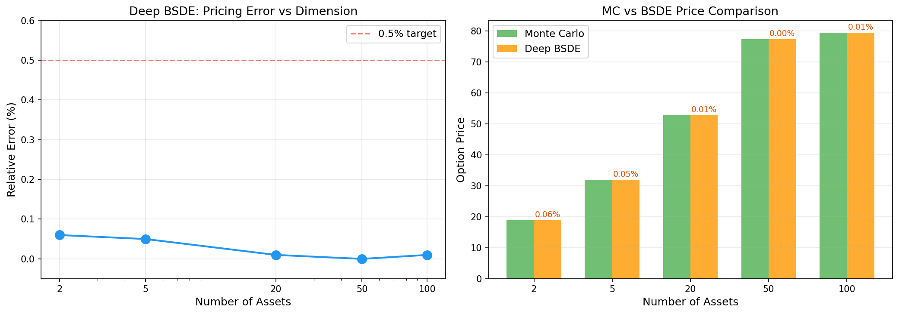

**MC convergence and payoff distribution (5-asset):**

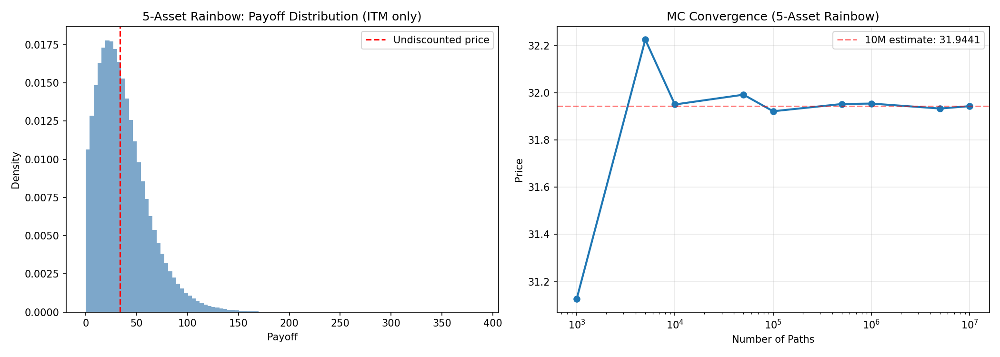

**2-asset FDM surface:**

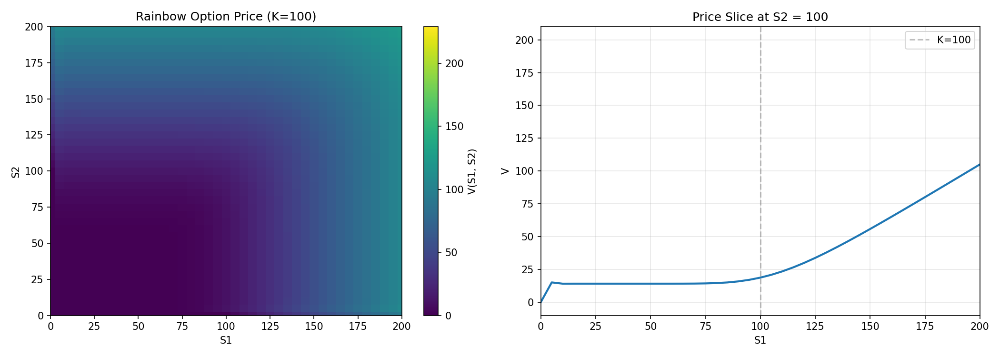

---

## Stage 3 — Results

### Ground Truth Validation: FD vs Semi-Analytical

| Method | Price (ATM, Heston benchmark) | Time |
|---|---|---|
| Semi-analytical (char fn) | 10.3140 | 12ms |
| FD (implicit, log-spot) | 10.3665 | 11s |
| Error | 0.51% | — |

The FD solver validates the characteristic function implementation. For data generation, the char fn is used — 50x faster and more accurate.

### DeepONet: Learning Heston Parameter → Vol Surface Mapping

874 valid Heston parameter sets generated (soft Feller condition filter). Each produces an implied vol surface on an 11×7 grid (moneyness × maturity). Split: 699 train, 175 test.

**Architecture:** Branch network (5→256→256→256→128) encodes Heston params. Trunk network (2→256→256→256→128) encodes query point (moneyness, T). Output = dot product of branch and trunk + bias.

| Metric | Value |
|---|---|
| Mean relative error | **0.38%** |
| MAE | 0.0010 |
| Max absolute error | 0.0185 |
| Surfaces under 1% | 171/175 (97.7%) |
| Train time | 54s |
| Target | <1% mean relative error |

**PASS.** The DeepONet learns the mapping from Heston parameters to entire implied vol surfaces without retraining — a single forward pass replaces solving the PDE.

**Training loss, predicted vs true, and per-surface error:**

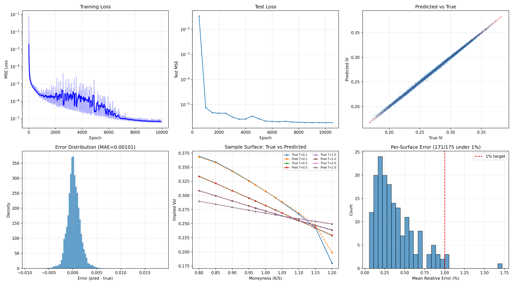

### Predicted Failure Mode: Extreme Parameter Regimes

The 4 surfaces that exceed 1% error share a pattern: low Feller ratio (2κθ/σ² near or below 1.0) or weak leverage effect (ρ near -0.2). These are the corners of parameter space where the vol surface shape changes qualitatively — variance can touch zero, creating a degenerate diffusion.

The worst surface (1.89% error) has σ=0.54, Feller ratio 0.53. This is exactly the failure mode predicted in the roadmap: "If parameters are sampled uniformly, the network will fail on extreme regimes."

**Error vs Heston parameters and Feller condition:**

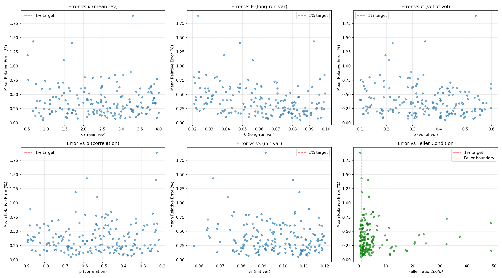

**Heston FD price surface V(S, v):**

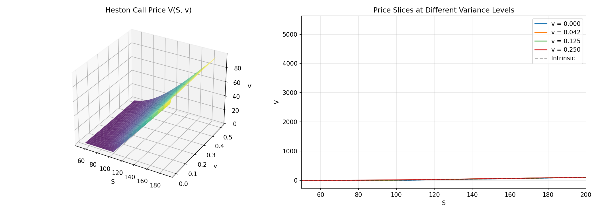

---

## Project Status

| Item | Status |
|---|---|
| Stage 1: Hard Constraints | Done |
| Stage 2: High-D Pricing | Done |
| Stage 3: Neural Operator | Done |
| Prerequisites (reading) | Done |
| Infrastructure setup | Done |

---

*Self-directed. Personal hardware. Personal accounts.*
